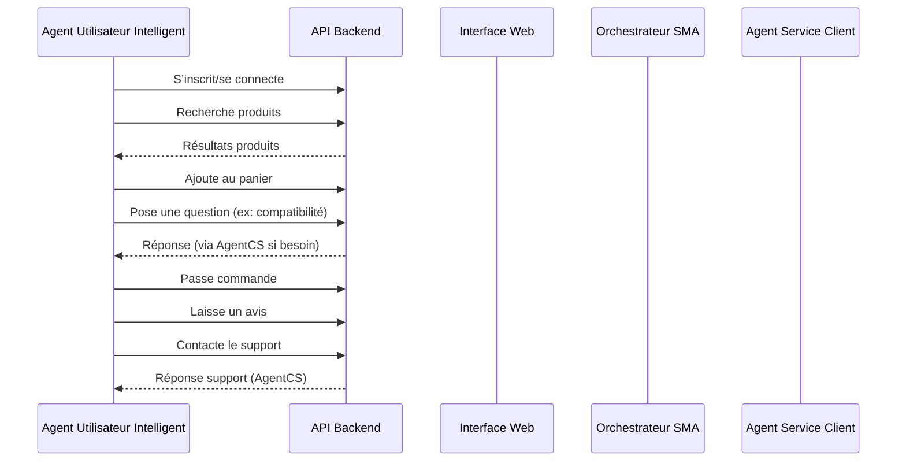

# Système Multi-Agent E-commerce Chatbot

Un système de chatbot intelligent basé sur une architecture multi-agent pour le e-commerce, utilisant LangGraph et LangChain.

## 🏗️ Architecture

### Vue d'ensemble

Le système est composé de 11 agents spécialisés qui collaborent pour gérer les interactions client :

```
┌─────────────────┐    ┌─────────────────┐    ┌─────────────────┐
│   Orchestrator  │    │  Conversation   │    │ Recommendation  │
│     Agent       │    │     Agent       │    │     Agent       │
└─────────────────┘    └─────────────────┘    └─────────────────┘
         │                       │                       │
         ▼                       ▼                       ▼
┌─────────────────┐    ┌─────────────────┐    ┌─────────────────┐
│  Product Search │    │ Order Management│    │ Customer Service│
│     Agent       │    │     Agent       │    │     Agent       │
└─────────────────┘    └─────────────────┘    └─────────────────┘
         │                       │                       │
         ▼                       ▼                       ▼
┌─────────────────┐    ┌─────────────────┐    ┌─────────────────┐
│    GDPR Agent   │    │  Monitoring     │    │  Escalation     │
│                 │    │     Agent       │    │     Agent       │
└─────────────────┘    └─────────────────┘    └─────────────────┘
         │                       │                       │
         ▼                       ▼                       ▼
┌─────────────────┐    ┌─────────────────┐
│   Profiling     │    │   Summarizer    │
│     Agent       │    │     Agent       │
└─────────────────┘    └─────────────────┘
```

### Agents et leurs rôles

| Agent | Rôle | Capacités |
|-------|------|-----------|
| **Orchestrator** | Coordonne tous les autres agents | Routage, orchestration, analyse d'intention |
| **Conversation** | Gestion NLP et analyse d'intention | NLP, sentiment analysis, entity extraction |
| **Recommendation** | Recommandations personnalisées | ML, historique utilisateur, catalogue |
| **Product Search** | Recherche dans le catalogue | Recherche, filtres, tri |
| **Order Management** | Gestion des commandes | Statut, historique, annulation |
| **Customer Service** | Support client | FAQ, assistance, escalade |
| **GDPR** | Conformité RGPD | Gestion données, consentement |
| **Monitoring** | Surveillance système | Métriques, alertes, logs |
| **Escalation** | Transfert vers humain | Détection, routage, file d'attente |
| **Profiling** | Analyse comportementale | Segmentation, préférences |
| **Summarizer** | Résumés de conversations | Synthèse, rapports |

## 🚀 Installation

### Prérequis

- Python 3.8+
- PostgreSQL
- MongoDB
- Redis
- OpenAI API Key

### Installation

1. **Cloner le repository**
```bash
git clone <repository-url>
cd fidelobot
```

2. **Créer un environnement virtuel**
```bash
python -m venv venv
source venv/bin/activate  # Linux/Mac
# ou
venv\Scripts\activate  # Windows
```

3. **Installer les dépendances**
```bash
pip install -r requirements.txt
```

4. **Configuration**
```bash
cp env_example.txt .env
# Éditer .env avec vos paramètres
```

5. **Base de données**
```bash
# Créer les bases de données
createdb ecommerce_db
# Les tables seront créées automatiquement au premier lancement
```

6. **Lancer l'application**
```bash
python main.py
```

## 📊 Utilisation

### API Endpoints

#### Chat en temps réel (WebSocket)
```
ws://localhost:8000/ws/chat/{user_id}
```

#### API REST
```bash
# Chat
POST /api/chat
{
  "message": "Je cherche un smartphone",
  "user_id": "user123",
  "session_id": "session456"
}

# Recherche produits
GET /api/products/search?query=smartphone&limit=10

# Commandes utilisateur
GET /api/orders/{user_id}

# Analytics
GET /api/analytics/dashboard
```

#### Interface Admin
```
http://localhost:8000/admin
```

### Exemples d'utilisation

#### 1. Recherche de produits
```
Utilisateur: "Je cherche un smartphone sous 500€"
→ Product Search Agent → Recommendation Agent
→ Réponse: "Voici nos smartphones sous 500€..."
```

#### 2. Gestion de commande
```
Utilisateur: "Où est ma commande #12345 ?"
→ Order Management Agent
→ Réponse: "Votre commande est en cours de livraison..."
```

#### 3. Support client
```
Utilisateur: "J'ai un problème avec ma commande"
→ Customer Service Agent → Escalation Agent (si nécessaire)
→ Réponse: "Je vais vous aider. Pouvez-vous me donner plus de détails ?"
```

### Exemple de scénario utilisateur simulé

**Narratif** :
1. L’agent s’inscrit ou se connecte.
2. Il recherche un smartphone sous 500€.
3. Il parcourt 3 pages de résultats, clique sur 2 produits.
4. Il ajoute un produit au panier, hésite, le retire, compare avec un autre.
5. Il pose une question sur la compatibilité 5G.
6. Il ajoute finalement un produit au panier et passe commande.
7. Il laisse un avis sur le produit acheté.
8. Il contacte le service client pour une question sur la livraison.

**Technique (pseudo-code)** :
```python
await agent.action_connect_or_signup()
await agent.action_search_products(query="smartphone", filters={"price_max": 500})
await agent.action_browse_results(pages=3)
await agent.action_view_product(product_id=123)
await agent.action_add_to_cart(product_id=123)
await agent.action_hesitate_remove_from_cart(product_id=123)
await agent.action_compare_products([123, 456])
await agent.action_ask_question("Ce produit est-il compatible 5G ?")
await agent.action_add_to_cart(product_id=456)
await agent.action_checkout()
await agent.action_leave_review(product_id=456, rating=5, comment="Super rapport qualité/prix !")
await agent.action_contact_support("Où en est la livraison de ma commande ?")
```

## 🔧 Configuration

### Variables d'environnement principales

```bash
# IA
OPENAI_API_KEY=your_key_here
OPENAI_MODEL=gpt-4-turbo-preview

# Base de données
POSTGRES_HOST=localhost
POSTGRES_DB=ecommerce_db
MONGO_DB=ecommerce_analytics
REDIS_HOST=localhost

# Agents
MAX_CONCURRENT_SESSIONS=1000
ESCALATION_SENTIMENT_THRESHOLD=-0.3
```

### Configuration des agents

Chaque agent peut être configuré individuellement dans `config.py` :

```python
# Exemple : Configuration de l'agent de recommandation
recommendation_config = {
    "min_confidence": 0.7,
    "max_recommendations": 5,
    "use_collaborative_filtering": True
}
```

## 📈 Monitoring et Analytics

### Dashboard Admin

L'interface d'administration (`/admin`) fournit :

- **Métriques en temps réel** : Utilisateurs actifs, conversations, agents
- **Statut des agents** : Santé, performance, erreurs
- **Analytics** : Intentions, sentiment, escalades
- **Alertes** : Notifications en temps réel
- **Logs** : Historique des événements

### Métriques collectées

- **Conversations** : Nombre, durée, intentions
- **Agents** : Temps de réponse, taux d'erreur, utilisation
- **Utilisateurs** : Engagement, satisfaction, segments
- **Système** : Performance, ressources, alertes

## 🔒 Sécurité et RGPD

### Conformité RGPD

- **Consentement** : Gestion explicite du consentement
- **Portabilité** : Export des données utilisateur
- **Suppression** : Droit à l'oubli
- **Anonymisation** : Données anonymisées après délai

### Sécurité

- **Chiffrement** : Données sensibles chiffrées
- **Authentification** : JWT tokens
- **Autorisation** : Contrôle d'accès par rôle
- **Audit** : Logs de sécurité complets

## 🧪 Tests

```bash
# Tests unitaires
pytest tests/

# Tests d'intégration
pytest tests/integration/

# Tests de performance
pytest tests/performance/
```

## 📚 Documentation API

### Swagger UI
```
http://localhost:8000/docs
```

### OpenAPI Spec
```
http://localhost:8000/openapi.json
```

## 🚀 Déploiement

### Docker

```bash
# Build
docker build -t ecommerce-chatbot .

# Run
docker run -p 8000:8000 ecommerce-chatbot
```

### Production

1. **Variables d'environnement**
```bash
ENVIRONMENT=production
DEBUG=false
```

2. **Base de données**
```bash
# Utiliser des instances gérées
# PostgreSQL: AWS RDS, Google Cloud SQL
# MongoDB: MongoDB Atlas
# Redis: AWS ElastiCache, Redis Cloud
```

3. **Monitoring**
```bash
# Activer Sentry
SENTRY_DSN=your_sentry_dsn

# Métriques Prometheus
ENABLE_METRICS=true
```

## 🔄 Flux de données

### 1. Réception d'un message
```
Utilisateur → WebSocket/API → Orchestrator Agent
```

### 2. Analyse et routage
```
Orchestrator → Conversation Agent (NLP) → Détermination de l'intention
```

### 3. Traitement spécialisé
```
Intent → Agent spécialisé → Traitement → Réponse
```

### 4. Monitoring et profilage
```
Monitoring Agent → Métriques → Profiling Agent → Mise à jour profil
```

### 5. Réponse finale
```
Orchestrator → Formatage → Utilisateur
```

## 🎯 User Stories couvertes

### Client
- ✅ Rechercher des produits
- ✅ Obtenir des recommandations personnalisées
- ✅ Suivre ses commandes
- ✅ Obtenir de l'aide et support
- ✅ Gérer ses données personnelles (RGPD)

### Support
- ✅ Escalade automatique vers humain
- ✅ Résumés de conversations
- ✅ Analytics des interactions
- ✅ Gestion des tickets

### Développeur
- ✅ Monitoring en temps réel
- ✅ Logs détaillés
- ✅ Métriques de performance
- ✅ Configuration flexible

### RGPD
- ✅ Gestion du consentement
- ✅ Export des données
- ✅ Suppression des données
- ✅ Audit trail

## 🤝 Contribution

1. Fork le projet
2. Créer une branche feature (`git checkout -b feature/AmazingFeature`)
3. Commit les changements (`git commit -m 'Add AmazingFeature'`)
4. Push vers la branche (`git push origin feature/AmazingFeature`)
5. Ouvrir une Pull Request

## 📄 Licence

Ce projet est sous licence MIT. Voir le fichier `LICENSE` pour plus de détails.

## 🆘 Support

- **Email** : abdelilahourti@gmail.com

## 🔮 Roadmap

- [ ] Intégration avec plus de plateformes e-commerce
- [ ] Support multilingue avancé
- [ ] IA conversationnelle plus sophistiquée
- [ ] Intégration avec des systèmes de paiement
- [ ] Support pour la réalité augmentée
- [ ] Analytics prédictifs 

## 🧑‍💻 Agent Utilisateur Intelligent (AUI)

### Objectif
Un agent SMA autonome qui simule un utilisateur humain sur le site e-commerce : navigation, recherche, ajout au panier, commande, avis, questions, etc. Il interagit avec l’API backend et/ou l’interface web, et simule des comportements humains variés (curiosité, hésitation, comparaison, etc.).

### Architecture et intégration
- **UserSimulationAgent** (nouveau module SMA) : Agent principal qui orchestre les actions utilisateur.
- **Orchestrateur SMA** : Pilote le scénario, active l’agent utilisateur selon l’état ou la demande.
- **API Backend** : L’agent utilise les endpoints REST/WebSocket pour toutes les actions (auth, recherche, panier, commande, avis…).
- **Interface Web/Chat** : Permet d’observer, piloter ou dialoguer avec l’agent (optionnel : automatisation navigateur pour simuler la navigation réelle).
- **Simulateur de comportements** : Génère des scénarios variés (aléatoires ou scriptés), avec pauses, hésitations, retours en arrière, etc.

### Flux général
1. L’agent s’inscrit ou se connecte via l’API.
2. Il parcourt les catégories, consulte des produits, lit des avis.
3. Il utilise la recherche, compare des produits, pose des questions.
4. Il ajoute au panier, hésite, retire/ajoute, puis passe commande.
5. Il laisse un avis, contacte le service client si besoin.
6. Il reçoit et réagit à des suggestions personnalisées.
7. Il peut dialoguer avec un humain via une interface chat.

### Points d’intégration
- Ajout du module `UserSimulationAgent` dans `SMA/agents/`
- Intégration dans l’orchestrateur SMA (`SMA/core/orchestrator.py`)
- Ajout d’un nœud dans le graphe LangGraph pour piloter l’agent
- (Optionnel) Création d’une interface web/chat pour observer ou dialoguer avec l’agent 

### Modules/Fichiers à modifier ou créer pour l’agent utilisateur intelligent

| Module/Fichier | Action |
|----------------|--------|
| `SMA/agents/user_simulation_agent.py` | **Nouveau** : Agent principal simulant l’utilisateur |
| `SMA/agents/base_agent.py` | Étendre pour supporter des actions web/API |
| `SMA/core/orchestrator.py` | Ajouter la gestion des scénarios utilisateur et l’intégration de l’agent |
| `SMA/models/user_models.py` | Étendre pour profils, préférences, historique |
| `SMA/core/config.py` | Ajouter config pour scénarios, profils, etc. |
| `SMA/agents/conversation_agent.py` | Permettre dialogue humain-agent |
| `SMA/agents/customer_service_agent.py` | Interaction avec l’agent utilisateur |
| `similateurdata/` | Réutiliser pour générer profils, historiques, etc. |
| `interface/` | Ajouter un chat ou dashboard pour observer/interagir |
| `README.md` | Ajouter guide de démo et documentation | 

### Orchestration des interactions

- **Agent utilisateur (UserSimulationAgent)** : pilote les actions comme un vrai client (connexion, navigation, achat, avis, support, etc.).
- **Orchestrateur SMA** : reçoit les intentions/scénarios, active l’agent utilisateur ou d’autres agents selon le contexte.
- **Backend/API** : l’agent utilise les endpoints REST/WebSocket pour toutes les actions (auth, recherche, panier, commande, avis…).
- **Front-end (interface web/chat)** : permet d’observer, piloter ou dialoguer avec l’agent (optionnel : automatisation navigateur pour simuler la navigation réelle).
- **Simulation comportementale** : l’agent peut suivre des scénarios scriptés ou générer des actions aléatoires, avec pauses, hésitations, retours en arrière, etc.
- **Flux de données** :
    1. L’agent envoie des requêtes à l’API backend (ex : POST /api/chat, GET /api/products/search, etc.).
    2. Les réponses sont traitées par l’agent, qui décide de la prochaine action.
    3. Les actions et états sont remontés à l’orchestrateur pour suivi et pilotage global.
    4. (Optionnel) Les actions de l’agent peuvent être visualisées ou pilotées via une interface web/chat. 

### Diagramme de séquence : Agent utilisateur intelligent

